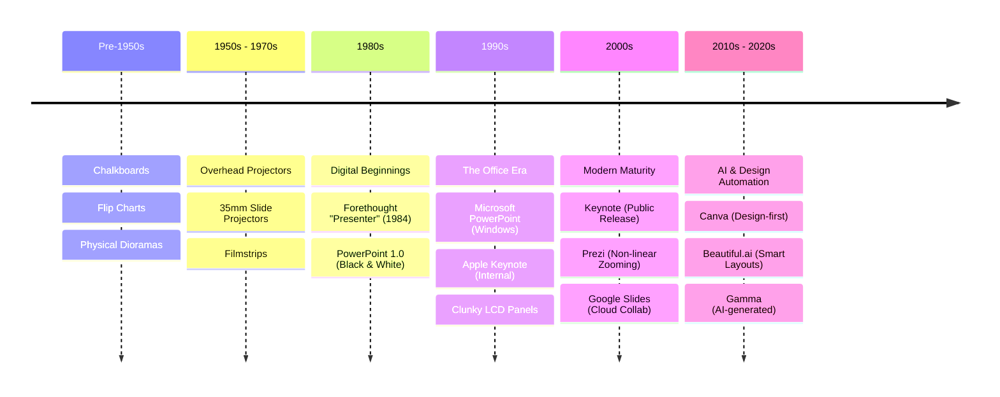

---
# try also 'default' to start simple
# theme: editorial
# theme: apple-basic
theme: default
# random image from a curated Unsplash collection by Anthony
# like them? see https://unsplash.com/collections/94734566/slidev
background: https://cover.sli.dev
# some information about your slides (markdown enabled)
title: Introduction to Slidev
info: |
  ## Slidev Introduction
  A brief introduction to Slidev framework
author: Vašek Lorenc
date: 2026
transition: slide-left
duration: 30m
addons:
  - stem
mdc: true
hideInToc: true
---

# Introduction to Slidev
### Vašek Lorenc | Feb 2026

---
image: https://cover.sli.dev
layout: image-right
---

# Outline

- PowerPoint
    - Why it works
	- Where it fails
- Markdown presentation frameworks
- Slidev
    - Basics
    - Addons
    - Layouts
    - Custom themes

---
# layout: center
layout: section
background: https://pbs.twimg.com/profile_images/1973441092575170560/WukzXtm_.jpg
---

# PowerPoint

Presentations made (too?) easy

---
layout: two-cols-header
level: 2
---

# Presentations made easy

**PowerPoint** made presentations easy and available to masses.

::left::

## Advantages
- easy to use
- export options
- prevalence
- strong business focus
- master slides are useful
- sections, finally!

::right::

## Weak points
- accessibility challenges
- information overload
- limited interactivity
- limited integration/generation
- linear structure
- inconsistent design quality

---
level: 2
---

# PowerPoint considered harmful

Internet is full of articles arguing against (over)using PowerPoint.

1. PowerPoint doing the thinking
2. focus on design
3. slides as a script
4. overusing the medium of slides
5. information overload
6. not ideal for complex graphs/charts

Source: [Matthew Caldwell: PowerPoint Considered Harmful](https://www.ucl.ac.uk/~ucbpmbc/old/ppoint.html)

<!--
It's pretty short, so you can check the article quickly: 
Source: [Matthew Caldwell: PowerPoint Considered Harmful](https://www.ucl.ac.uk/~ucbpmbc/old/ppoint.html)
-->

---
layout: image
image: img/too-much-text-ppt-slide.png
---

<!--
And this is still relatively readable, definitely not the worst example I could use.
-->

---
# layout: center
layout: section
---

# Markdown

Focus on the content

---
layout: two-cols-header
level: 2
---

# Markdown presentation frameworks

Markdown is a popular format among developers and engineers, but the ecosystem is fragmented.

::left::

### Web/JS Based

- [RevealJS](https://revealjs.com/)
  - [webpro/reveal-md](https://github.com/webpro/reveal-md)
  - [slid.es editor](https://slid.es)
  - most adopted solution
- [Marp: Markdown Presentation Ecosystem](https://marp.app/)
- [Slidev](https://sli.dev/)
  - We'll be talking about this!

::right::

### Others

- Marimo Slides view
  - [Marimo](https://marimo.io/) for the win!
  - Great for data scientists
- [Obsidian Advanced Slides](https://github.com/MSzturc/obsidian-advanced-slides)
  - great if you love your notes
- [pandoc](https://pandoc.org/demo/example33/10-slide-shows.html)
- [presenterm](https://mfontanini.github.io/presenterm/)

<!--
And there are others I missed and didn't mention and they provide slideshow
functionality powered by Markdown. Some are not maintained already, some are
included in other tools and frameworks, like [typst](https://typst.app/).
-->

---
level: 2
---

# Markdown frameworks problem

I often ended up mixing in a lots of HTML mixed into the markdown notes.

```markdown
# Presentation title

Presentation subtitle

<div class="absolute bottom-10">
  <span class="font-700">
    Author and Date
  </span>
</div>
```

Which makes the copy-pasting and redesigns painful again.

---
layout: two-cols-header
transition: slide-up
---

# Introduction to Slidev

Markdown based presentation framework with plenty of customization options

::left::

- **features overview**
	- all the common features
	- syntax highlighters
	- mermaid
	- flexible animations
- **layouts**
	- design customization options
    - extensibility

::right::

- **Vue.js components**
	- Slidev add-ons
- **interactive code editor**
    - Monaco editor
    - by default for TypeScript
    - available for Python as add-on

---
transition: slide-up
level: 2
---

# What is Slidev?

Slidev is a slide-making and presentation tool designed for developers with the following features

- 📝 **Text-based**: focus on the content with Markdown, and then style them later
- 🎨 **Themable**: themes can be shared and re-used as npm packages
- 🧑‍💻 **Developer Friendly**: code highlighting, live coding with autocompletion
- 🤹 **Interactive**: embed Vue components to enhance your expressions
- 🎥 **Recording**: built-in recording and camera view
- 📤 **Portable**: export to PDF, PPTX, PNGs, or even a hostable SPA
- 🛠 **Hackable**: virtually anything that's possible on a webpage is possible in Slidev

---
level: 2
transition: slide-up
layout: two-cols-header
---

# Generated table of contents

You can use the `Toc` component to generate a table of contents for your slides:

::left::

```html
<Toc minDepth="1" maxDepth="1" />
```

::right::
<Toc minDepth="1" maxDepth="1" />

---
transition: slide-up
level: 2
---

# Mermaid

Mermaid lets you create diagrams and visualizations using text and code.



See [mermaid docs](https://mermaid.js.org/) for more details. 
Or [beautiful mermaid](https://agents.craft.do/mermaid) for stylish rendering.

<!--
Another related project worth mentioning is https://agents.craft.do/mermaid
which allows rendering to beautifully styled components, or to ASCII art!
-->

---
transition: slide-up
level: 2
---

<script setup>
import { ref } from 'vue'

// This variable holds the counter value
const myValue = ref(10)
</script>

# Slidev Vue.js components

Any Vue component can be embedded directly into your slides.

<Counter v-model:count="myValue" />

<AutoFitText :max="200" :min="80" :modelValue="`The value is: ${myValue}`" />

Not the most useful example, I know.

---
transition: slide-up
level: 2
layout: image-right
image: https://i.pinimg.com/736x/c7/54/7f/c7547fff170fcd339afc34adba860462.jpg
---

# Slidev Vue.js components

Neither is this one :)

<GlitchHeader text="Cyberpunk 2077: Hackerman"/>

---
transition: slide-up
level: 2
class: dense
---

# Shiki Magic Move

Powered by [shiki-magic-move](https://shiki-magic-move.netlify.app/), Slidev supports animations in code snippets.

Add multiple code blocks and wrap them with <code>````md magic-move</code> (four backticks) to use it.

````md magic-move {lines: true}
```ts {*|2|*}
// step 1
const author = reactive({
  name: 'John Doe',
  books: [
    'Vue 2 - Advanced Guide',
    'Vue 3 - Basic Guide',
    'Vue 4 - The Mystery'
  ]
})
```

```ts {*|1-2|3-4|3-4,8}
// step 2
export default {
  data() {
    return {
      author: {
        name: 'John Doe',
        books: [
          'Vue 2 - Advanced Guide',
          'Vue 3 - Basic Guide',
          'Vue 4 - The Mystery'
        ]
      }
    }
  }
}
```

```ts
// step 3
export default {
  data: () => ({
    author: {
      name: 'John Doe',
      books: [
        'Vue 2 - Advanced Guide',
        'Vue 3 - Basic Guide',
        'Vue 4 - The Mystery'
      ]
    }
  })
}
```

Non-code blocks are ignored.

```vue
<!-- step 4 -->
<script setup>
const author = {
  name: 'John Doe',
  books: [
    'Vue 2 - Advanced Guide',
    'Vue 3 - Basic Guide',
    'Vue 4 - The Mystery'
  ]
}
</script>
```
````


---
transition: slide-up
level: 2
---

# Slidev Add-ons

Add-ons let you extend Slidev with additional functionality; e.g. plotting.

<PlotlyFigure
  src="figure.json"
  caption="Figure 1: Sample Figure"
  width="100%"
  height="320px"
  :fontSize="12"
/>

---
transition: slide-up
level: 2
---

# Slidev Layouts

Simplified building blocks for your presentations. With built-in placeholders.

## Built-in layouts
- `cover`
- `default`
- `quote`
- `center`
- `image-right`
- `iframe`
- `end`
...

See [builtin layouts](https://sli.dev/builtin/layouts) for more details.

---
layout: quote
transition: slide-up
# layout: image-left
image: https://vltava.rozhlas.cz/sites/default/files/images/00743001.jpeg
level: 2
---

“There is no charge for awesomeness... or attractiveness.”

<template v-slot:author>
  Po (Kung Fu Panda)
</template>

---
layout: image-right
image: https://sli.dev/screenshots/presenter-mode.png
backgroundSize: contain
level: 2
---

# Presenter Mode

Don't just look at code. Slidev generates a synchronized multi-window experience.

- **Notes**: See your markdown comments.
- **Next Slide**: Preview what's coming.
- **Timer**: Keep track of your duration.
- **Drawing**: Annotate directly on the slide.
- **Export**: Export your slides.

<v-click>
<div class="bg-gray-100 dark:bg-gray-800 p-4 rounded text-sm">
💡 <b>Pro Tip:</b> You can share the presentation URL with the audience so they can follow along on their own devices!
</div>
</v-click>

---
layout: two-cols-header
level: 2
---

# Slidev Custom Themes

Package your layouts, styling, and automation into a reusable theme.

### Custom layouts
- simplified design choices
- avoids HTML tags in Markdown notes

### Custom components
- "fancy" layout tricks

### Example
See [slidev-editorial-theme](https://slidev2.rodinny.cloud) example I am working on.

---
level: 2
---

# Slidev AI features

All this makes rapid prototyping with AI possible!
See [work with AI](https://sli.dev/guide/work-with-ai) for more details.

## Skills

- provides official skills for AI coding agents 
   - Slidev's syntax,
   - features, Typescript components, ...

## Installation

```bash
npx skills add slidevjs/slidev
```


<!--
We live in the 21st century, so we need to include AI in the presentation!
-->

---
# layout: center
layout: section
background: https://pbs.twimg.com/profile_images/1973441092575170560/WukzXtm_.jpg
---

# Custom theme

Prototyped rapidly with Gemini.

---
layout: iframe
url: https://slidev2.rodinny.cloud 
level: 2
---

...

---
layout: two-cols-header
level: 2
---

# Starting with `editorial` theme

Using my theme is easy now, but be careful: **it's not ready for production use yet**.

````md magic-move {lines: true}
```bash {1|2|3|4|*}
pnpm create slidev slidev-editorial-presentation
cd slidev-editorial-presentation
pnpm install
pnpm install https://github.com/valorcz/slidev-theme-editorial

# (... edit your slides.md ...)

pnpm run dev
```
````

---
level: 2
---

# Starting with `editorial` theme

## Additional layouts

- `section`
   - automated section numbering; sets the left/right bar title
- `end`
   - thank you & questions slide

## Additional components
- `Card`, `Footer`, `HeroCube`, ...

---
layout: end
hideInToc: true
---

# Thank you!

## Any questions? :)

---
layout: section
---

# Bonus section!

To boldly go where just a few have gone before.

---
layout: iframe
url: https://lucharo.github.io/slidev-marimo/
---

<!--
This is a bonus slide to illustrate that people
use slidev & marimo together, which makes it
an extremely interesting combination for (not only) me :))
-->
